# email_firebase-postmain
Dokumentasi ini menjelaskan proses pengujian API Firebase Authentication menggunakan Postman.  
Pengujian yang dilakukan meliputi:

- Membuat akun baru (Sign-Up)
- Mengirim email verifikasi
- Mengecek status verifikasi akun

Teknologi yang digunakan:
- Firebase Authentication
- Postman
- Firebase REST API

---

# 1. Persiapan Firebase

## 1.1 Masuk ke Firebase Console

Langkah pertama adalah membuka Firebase Console dan membuat atau memilih project yang akan digunakan.

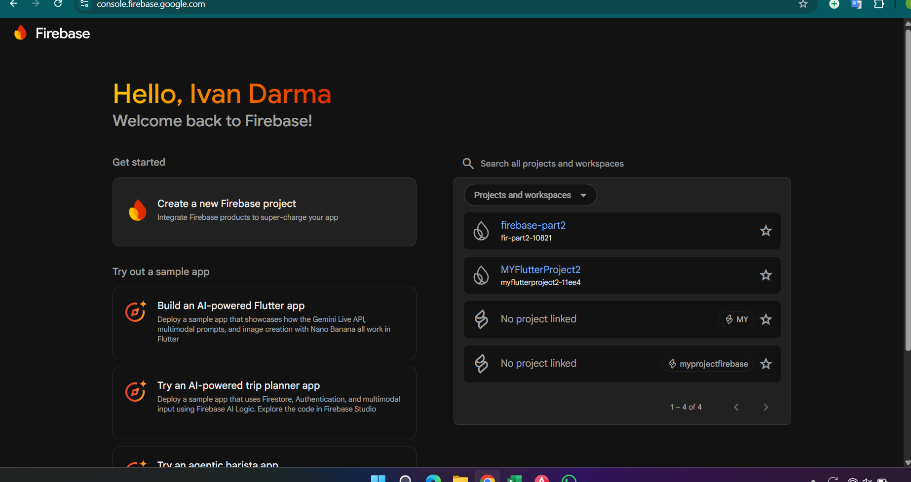

---

## 1.2 Mengaktifkan Authentication Method

Masuk ke menu **Authentication → Sign-in Method** lalu aktifkan:

- Google Sign-In
- Email/Password

Hal ini memungkinkan pengguna untuk melakukan autentikasi menggunakan email atau akun Google.

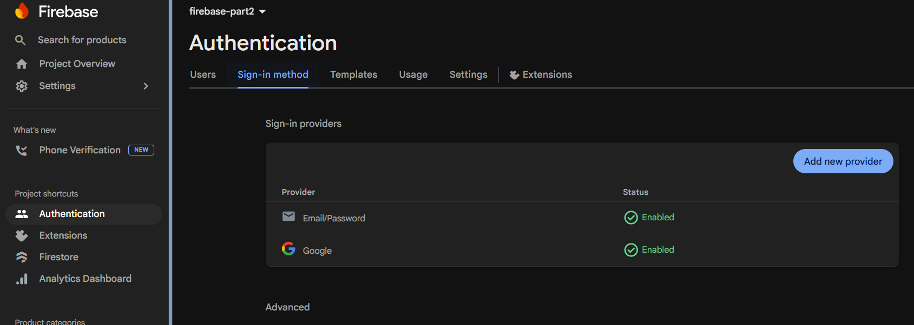

---

## 1.3 Mengambil Firebase API Key

Untuk menggunakan Firebase REST API, kita memerlukan **API Key** dari project Firebase.

Langkah:
1. Masuk ke **Project Settings**
2. Cari bagian **Web API Key**

API Key ini akan digunakan pada request API di Postman.

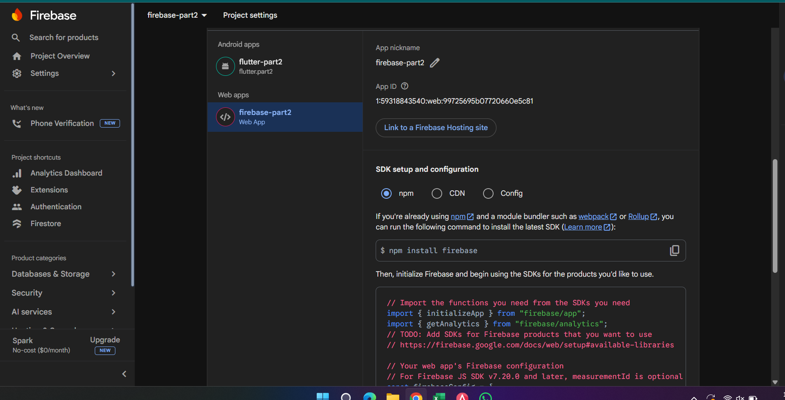

---

# 2. Setup Postman Environment

## 2.1 Membuat Environment Baru

Buka Postman lalu buat **Environment baru** untuk menyimpan variabel seperti:

- `firebase_api_key`

Hal ini memudahkan penggunaan API Key di berbagai request.


---

# 3. Request API - Sign Up (Membuat Akun Baru)

Endpoint yang digunakan: "POST https://identitytoolkit.googleapis.com/v1/accounts:signUp?key={{FIREBASE_API_KEY}}
"

---

## 3.1 Parameter Request

Pada bagian **Params**, tambahkan parameter berikut:

| Key | Value |
|----|----|
| key | {{firebase_api_key}} |

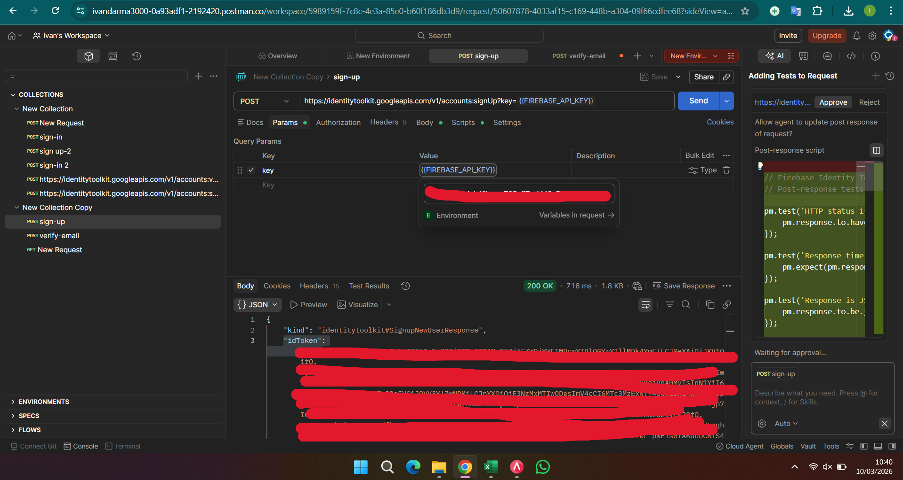

---

## 3.2 Header Request

Pada bagian **Headers**, tambahkan konfigurasi berikut:

| Key | Value |
|----|----|
| Content-Type | application/json |

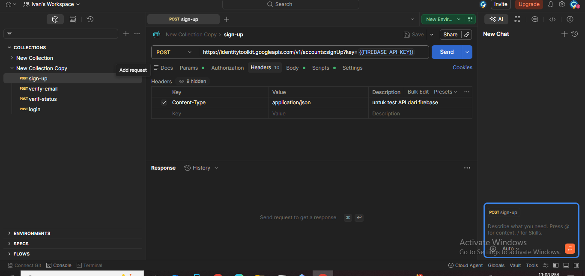

---

## 3.3 Body Request

Gunakan format **JSON** pada body request.

Contoh nilai yang dimasukkan ke dalam body: email, password, dan returnSecureToken

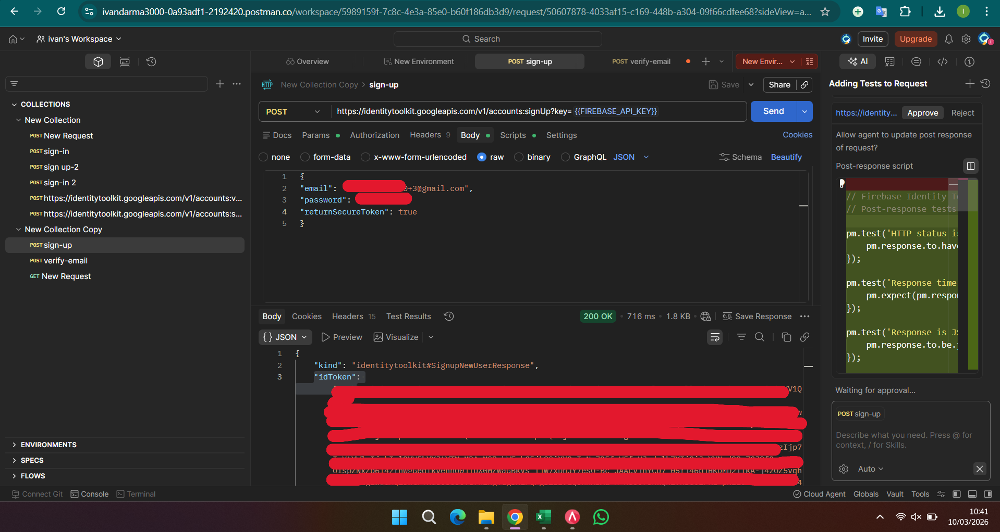

---

## 3.4 Contoh Script JSON Body

Berikut adalah contoh script JSON yang digunakan dalam body request untuk melakukan Sign-Up:

```json
{
  "email": "user@example.com",
  "password": "securePassword123!",
  "returnSecureToken": true
}
```

**Penjelasan:**
- `email`: Email yang akan didaftarkan untuk akun baru
- `password`: Password untuk akun tersebut (minimal 6 karakter)
- `returnSecureToken`: Flag untuk mengembalikan secure token jika pendaftaran berhasil

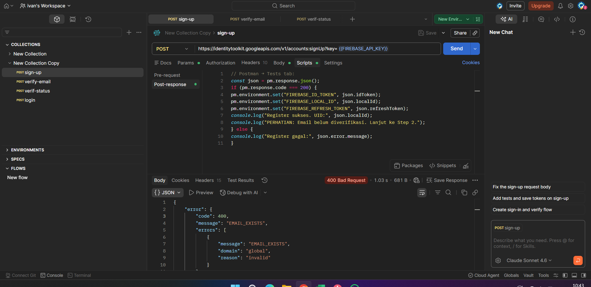

---

## 3.5 Response - Konsol & Hasil Berhasil

Ketika permintaan Sign-Up berhasil, Anda akan menerima response JSON dengan informasi berikut:

```json
{
  "idToken": "eyJhbGc...",
  "email": "user@example.com",
  "refreshToken": "AEnB2UqW...",
  "expiresIn": "3600",
  "localId": "ZY1rHQfqZXAIz8Oz..."
}
```

**Output Console:**
- `idToken`: Token yang digunakan untuk autentikasi request berikutnya
- `email`: Email yang terdaftar
- `refreshToken`: Token untuk refresh session
- `expiresIn`: Waktu kadaluarsa token dalam detik
- `localId`: Unique ID untuk user yang baru dibuat

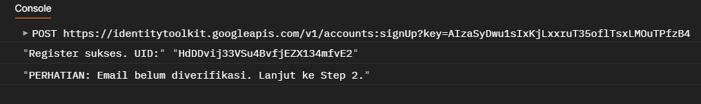

---

## 3.6 Handling Error - Bad Request (400)

Jika terjadi kesalahan dalam request, Anda akan menerima response error dengan status code **400 Bad Request**.

Beberapa contoh error yang umum terjadi:

### Error 1: Email Sudah Terdaftar
```json
{
  "error": {
    "code": 400,
    "message": "EMAIL_EXISTS",
    "errors": [
      {
        "message": "EMAIL_EXISTS",
        "domain": "global",
        "reason": "invalid"
      }
    ]
  }
}
```

### Error 2: Password Terlalu Pendek
```json
{
  "error": {
    "code": 400,
    "message": "WEAK_PASSWORD : Password should be at least 6 characters",
    "errors": [
      {
        "message": "WEAK_PASSWORD : Password should be at least 6 characters",
        "domain": "global",
        "reason": "invalid"
      }
    ]
  }
}
```

### Error 3: Format Email Tidak Valid
```json
{
  "error": {
    "code": 400,
    "message": "INVALID_EMAIL",
    "errors": [
      {
        "message": "INVALID_EMAIL",
        "domain": "global",
        "reason": "invalid"
      }
    ]
  }
}
```

**Penyelesaian:**
- Pastikan email belum terdaftar sebelumnya
- Gunakan password minimal 6 karakter
- Gunakan format email yang valid (contoh: user@domain.com)
- Pastikan API Key sudah benar dan aktif

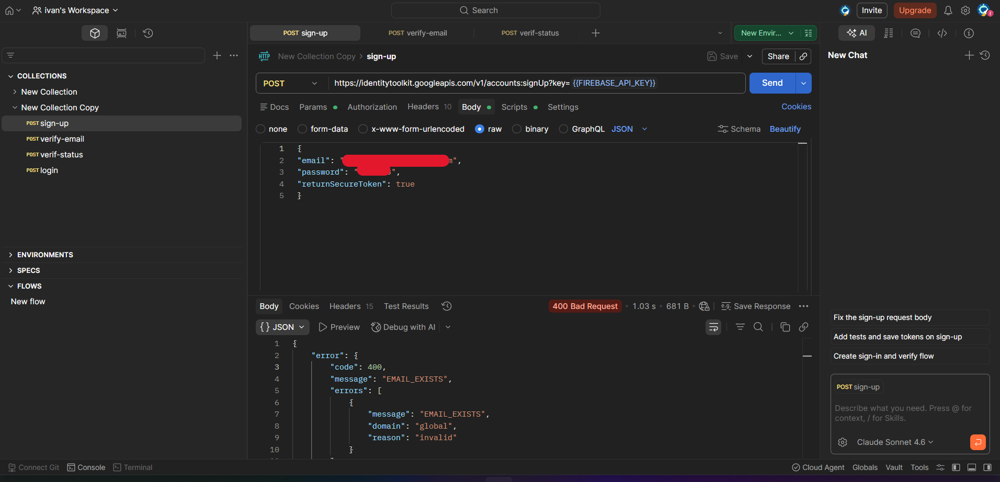

---

---

# 4. Request API - Send Email Verification (Mengirim Email Verifikasi)

Endpoint yang digunakan: "POST https://identitytoolkit.googleapis.com/v1/accounts:sendOobCode?key={{FIREBASE_API_KEY}}
"

Fitur ini memungkinkan Anda untuk mengirim email verifikasi ke pengguna yang baru didaftarkan.

---

## 4.1 Parameter Request
Pada bagian **Params**, tambahkan parameter berikut:

| Key | Value |
|----|----|
| key | {{firebase_api_key}} |

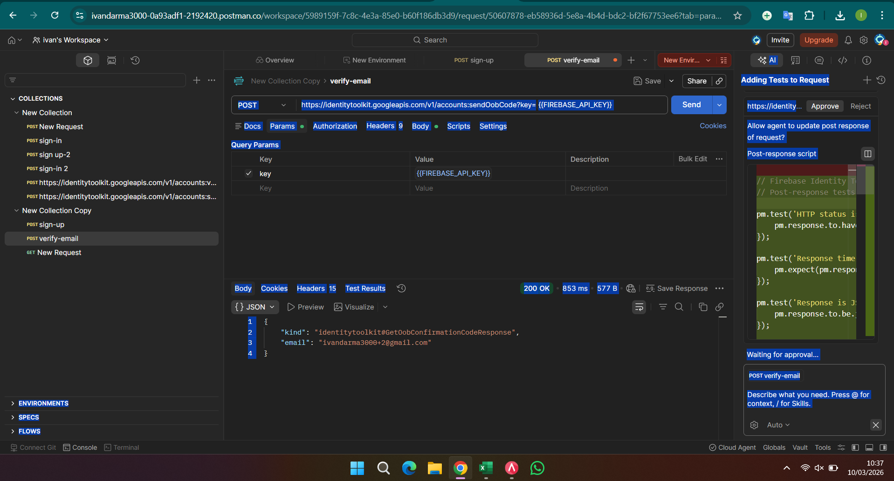

---

## 4.2 Header Request

Pada bagian **Headers**, tambahkan konfigurasi berikut:

| Key | Value |
|----|----|
| Content-Type | application/json |


---

## 4.3 Body Request

Pada bagian **Body**, tambahkan konfigurasi berikut:

```json
{
  "RequestType": "VERIFY_EMAIL",
  "idToken": "AEnB2UqW...",
}
```

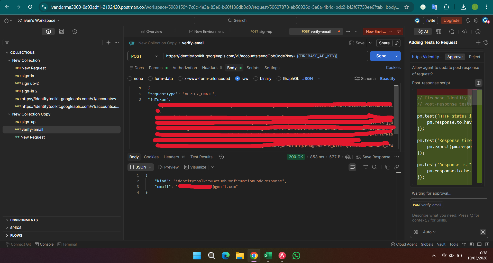

---

## 4.4 script Request

Pada bagian **script**, tambahkan konfigurasi berikut:

```json
// Postman → Tests tab:
if (pm.response.code === 200) {
const json = pm.response.json();
console.log("Email verifikasi dikirim ke:", json.email);
console.log("Sekarang buka inbox email dan klik link verifikasi.");
console.log("Setelah klik, lanjut ke Step 3 untuk cek status.");
} else {
console.log("Gagal kirim email:", pm.response.json().error.message);
}
```
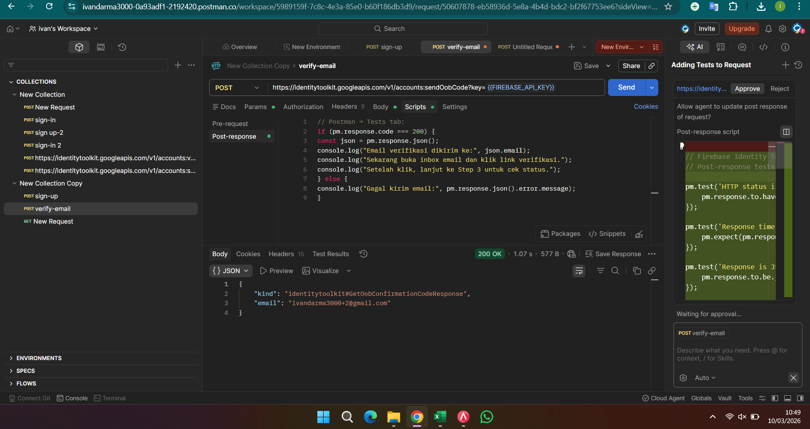

---

## 4.5 verify email berhasil
jika berhasil. pada console.log akan muncul tulisan seperti ini

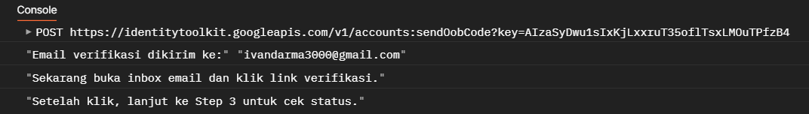

---

# Endpoint ini digunakan untuk melihat informasi akun, termasuk apakah email sudah **verified** atau belum.
POST https://identitytoolkit.googleapis.com/v1/accounts:lookup?key={{FIREBASE_API_KEY}}

---

## 8.1 Parameter Request

Pada tab **Params**, tambahkan parameter berikut:

| Key | Value |
|-----|------|
| key | {{firebase_api_key}} |

Parameter ini digunakan untuk mengakses Firebase REST API menggunakan API Key dari project Firebase.

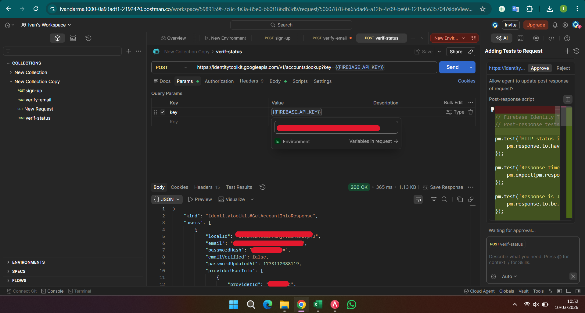

---

## 8.2 Body Request

Pada bagian **Body**, gunakan format JSON berikut:

```json
{
  "idToken": "{{idToken}}"
}
```
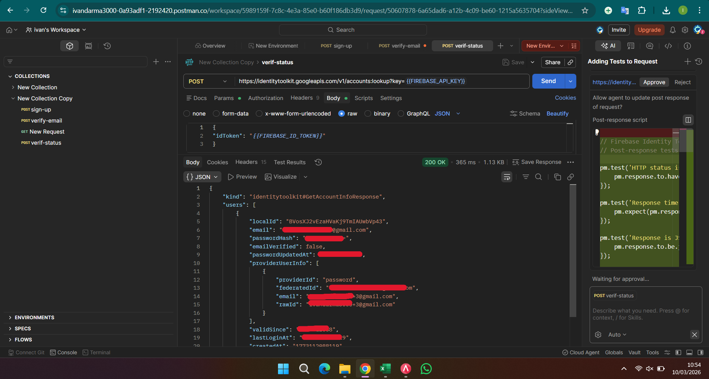

## 8.3 penerimaan melalui email

setelah user menjalankan kode pada bagian body, sebuah pesan berupa email pada akun tertaut akan muncul, pengguna harus 
mengklik tautan agar dapat diterima oleh sistem. setelahnya sistem akan menandai bahwa pengguna telah terverifikasi

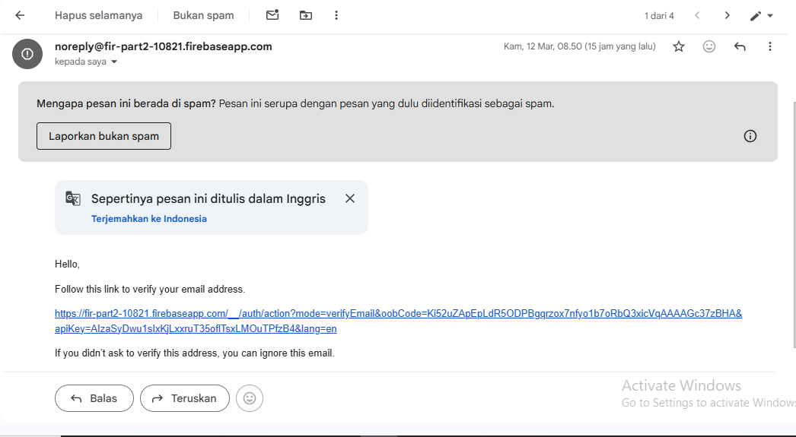

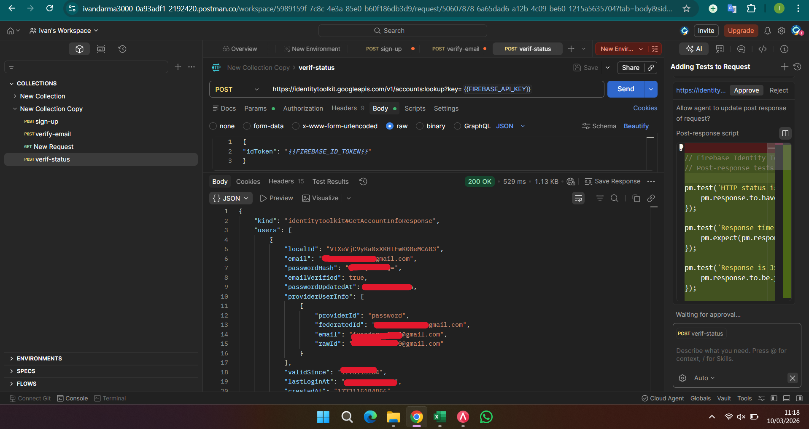

